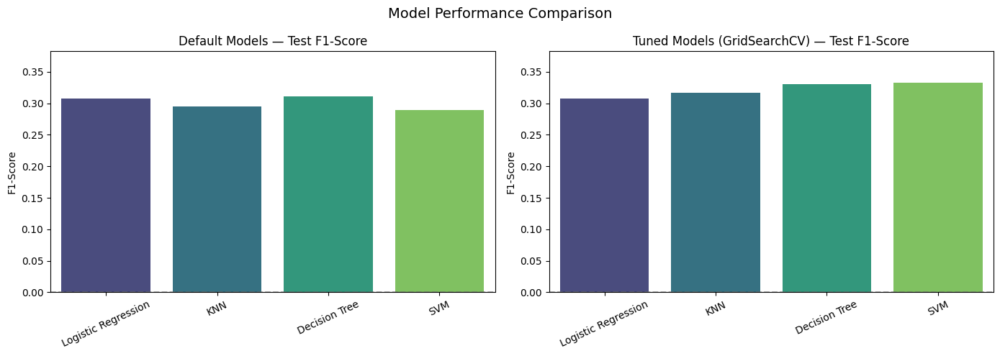
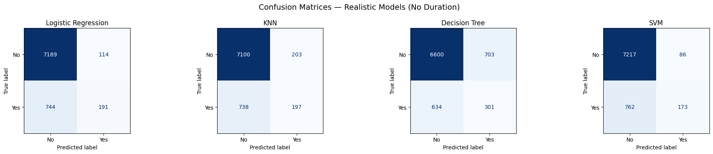
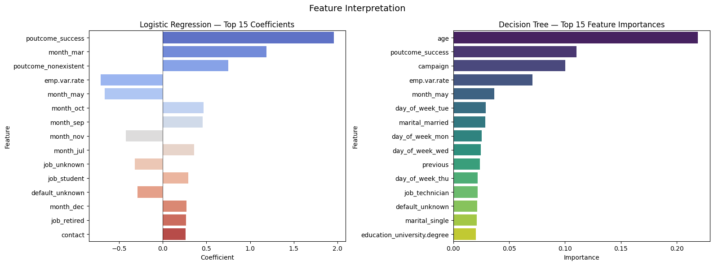

# Comparing Classifiers: Bank Marketing Dataset

## Overview

A Portuguese banking institution ran 17 telephone marketing campaigns (2008-2010) to sell term deposit subscriptions. Out of ~41,000 contacts, only about 11% subscribed. This project compares four classification models to predict which clients will subscribe, enabling the bank to target campaigns more effectively.

**Models compared:** Logistic Regression, K-Nearest Neighbors, Decision Trees, Support Vector Machines

## Notebook

[Jupyter Notebook](prompt_III.ipynb)

## Dataset

Source: [UCI Machine Learning Repository - Bank Marketing](https://archive.ics.uci.edu/dataset/222/bank+marketing)

41,188 records with 20 input features covering client demographics, campaign contact details, and economic indicators. The target variable is heavily imbalanced (~88% no, ~12% yes).

## Approach

1. **Exploratory Data Analysis** - identified hidden missing values, class imbalance, and multicollinearity among economic indicators
2. **Feature Engineering** - one-hot encoding categoricals, dropping low-signal features (housing, loan, pdays), reducing redundant economic indicators to Employment Variation Rate
3. **Baseline Models** - trained all four classifiers with default parameters
4. **Hyperparameter Tuning** - GridSearchCV with 5-fold cross-validation optimizing F1-score
5. **Evaluation** - comparison on F1-score, confusion matrices, and feature interpretation

## Key Findings

**Decision Tree was the recommended model** (F1: 0.33, identified 301/935 subscribers). While all models achieved ~89% accuracy, this is barely above the 88.8% baseline of always predicting "no." F1-score revealed the real differences.

**Top predictive features:** Previous campaign success (65% conversion rate) and month of contact were the strongest signals across both Logistic Regression coefficients and Decision Tree importances.

## Actionable Recommendations

1. **Re-engage previous subscribers** - 65% conversion rate vs 9% for cold calls, yet 96% of contacts are cold calls
2. **Time campaigns in March, September, October, December** - subscription rates of 43-50% vs May at 6%
3. **Scale up during economic downturns** - clients are more receptive to safe deposits when the economy weakens
4. **Target age extremes** - students (31%) and retirees (25%) subscribe at 3-4x the rate of working professionals

## Next Steps

- Address class imbalance with SMOTE or class_weight='balanced'
- Test full economic indicator set vs reduced (EVR only)
- Improve data collection to reduce 20.9% unknown rate in the default column
- Explore ensemble methods (Random Forest, Gradient Boosting) for potential F1 improvement
